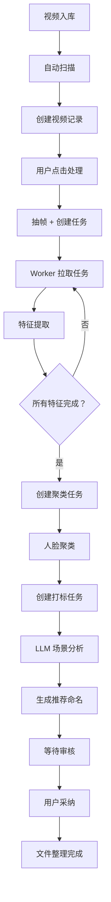

# 🎬 视频 AI 整理系统

<div align="center">

**基于人脸识别的智能视频整理解决方案**

[](https://www.python.org/downloads/)
[](https://fastapi.tiangolo.com/)
[](https://vuejs.org/)
[](https://www.postgresql.org/)

</div>

---

## 📖 项目简介

这是一套**完整的视频 AI 整理系统**，通过先进的人脸识别和深度学习技术，自动为视频文件生成结构化命名和标签。

**核心优势**：
- 🚀 **分布式架构** - NAS 与 Worker 分离，充分利用 GPU 资源
- 🎯 **精准人脸检测** - InsightFace 检测女性正脸
- 🧠 **智能聚类** - HDBSCAN 算法自动识别相同演员
- ✨ **AI 场景打标** - Qwen2.5 大模型生成场景标签
- 📊 **可视化管理** - 优雅的 Web 管理界面
- 🔄 **自动重试机制** - 完善的故障恢复

**适用场景**：
- 个人视频库整理
- 影视资源管理
- 监控视频分析
- 任何需要人脸识别的视频场景

---

## ✨ 核心功能

### 工作流程

```
视频入库 → 自动扫描 → 智能抽帧 → 特征提取 → 人脸聚类 → 场景打标 → 推荐命名 → 用户审核 → 完成
```

### 功能模块

| 功能 | 技术栈 | 说明 |
|------|--------|------|
| 📹 **自动扫描** | File Watcher | 监控目录，自动发现新视频 |
| 🖼️ **智能抽帧** | FFmpeg | 基于场景检测，在镜头切换点抽帧 |
| 👤 **人脸检测** | InsightFace | 检测女性正脸，过滤侧脸/遮挡 |
| 🔍 **特征提取** | ArcFace | 512 维人脸特征向量 |
| 🎯 **智能聚类** | HDBSCAN | 自动聚类相似人脸 |
| 🏷️ **场景打标** | Qwen2.5-7B | LLM 生成场景/服装标签 |
| 📝 **推荐命名** | AI 生成 | `[演员]_[标签]_[原名]` 格式 |
| 📊 **任务监控** | 实时状态 | 可视化的任务进度和 Worker 状态 |
| 👥 **演员管理** | 跨视频匹配 | 识别并合并同一演员的不同聚类 |

### 技术亮点

- **分布式架构**: NAS 端负责任务调度，Worker 端专注 AI 计算
- **GPU 自适应**: 自动检测 GPU，支持 CPU/GPU 混合部署
- **断点续传**: 任务失败自动重试，支持手动重试
- **进度可视化**: 实时展示处理进度和统计信息
- **数据持久化**: PostgreSQL + pgvector 向量数据库

---

## 🏗️ 架构设计

### 系统架构

```
┌─────────────────────────────────────────────────────────────────┐
│                         前端页面 (Vue 3)                         │
│  📊 仪表盘  🎬 视频管理  👥 人脸聚类  ✅ 命名审核  📋 任务监控    │
└─────────────────────────────────────────────────────────────────┘
                                │
                                ▼
┌─────────────────────────────────────────────────────────────────┐
│                     NAS 服务器 (FastAPI + PostgreSQL)            │
│  ┌─────────────┐  ┌─────────────┐  ┌─────────────┐             │
│  │  视频扫描   │  │  抽帧服务   │  │  任务管理   │             │
│  │VideoScanner │  │FrameExtract │  │Task Router  │             │
│  └─────────────┘  └─────────────┘  └─────────────┘             │
│                                                                 │
│  ┌──────────────────────────────────────────────────┐          │
│  │         PostgreSQL 16 + pgvector 扩展            │          │
│  │  Videos | Frames | Faces | Clusters | Tasks     │          │
│  └──────────────────────────────────────────────────┘          │
└─────────────────────────────────────────────────────────────────┘
                                │
                                ▼
┌─────────────────────────────────────────────────────────────────┐
│                    Worker (本地 Python 进程)                      │
│  ┌─────────────┐  ┌─────────────┐  ┌─────────────┐             │
│  │ 特征提取    │  │ 人脸聚类    │  │ 场景打标    │             │
│  │InsightFace  │  │  HDBSCAN    │  │  LLM (Qwen) │             │
│  │   (GPU)     │  │   (CPU)     │  │  (GPU/CPU)  │             │
│  └─────────────┘  └─────────────┘  └─────────────┘             │
└─────────────────────────────────────────────────────────────────┘
```

### 工作流程



---

## 🚀 快速开始

### 前置要求

- **操作系统**: Windows 10/11, Linux, macOS
- **Python**: 3.11 或更高版本
- **Docker**: 20.10+ (用于 NAS 服务器)
- **GPU**: NVIDIA RTX 3060+ (推荐，用于加速 AI 计算)
- **存储**: 至少 10GB 可用空间（缓存目录）

### 1️⃣ NAS 端部署

#### 步骤 1: 克隆项目

```bash
cd nas-server
```

#### 步骤 2: 配置环境变量

```bash
# 复制示例配置
cp .env.example .env

# 编辑 .env 文件（可选，默认配置通常可用）
nano .env
```

**关键配置项**：
```bash
# 视频目录（根据你的实际路径修改）
RAW_VIDEO_DIR=/mnt/user/videos/raw
PROCESSED_VIDEO_DIR=/mnt/user/videos/processed

# 缓存目录（建议使用 SSD）
CACHE_DIR=/mnt/user/appdata/video-org/cache
FRAME_CACHE_DIR=/mnt/user/appdata/video-org/cache/frames
```

#### 步骤 3: 创建必要目录

```bash
mkdir -p media/raw media/processed cache/frames
```

#### 步骤 4: 启动服务

```bash
# 构建并启动
docker-compose up -d

# 查看日志
docker-compose logs -f app
```

#### 步骤 5: 访问 Web 界面

打开浏览器访问：
```
http://localhost:8000
```

**默认界面**：
- 📊 仪表盘 - 系统概览
- 🎬 视频管理 - 浏览和扫描视频
- 👥 人脸聚类 - 角色管理
- ✅ 命名审核 - 审核 AI 推荐
- 📋 任务监控 - 查看任务状态

### 2️⃣ Worker 端部署

Worker 有两种部署方式，**推荐直接运行**（更容易使用本地 GPU）。

#### 方式一：直接运行（推荐）

##### 步骤 1: 安装依赖

```bash
cd worker

# 方式 A: 使用 requirements.txt（版本固定）
pip install -r requirements.txt

# 方式 B: 安装最新版（兼容性更好）
pip install torch torchvision --index-url https://pypi.tuna.tsinghua.edu.cn/simple
pip install insightface onnxruntime transformers accelerate bitsandbytes hdbscan scikit-learn opencv-python-headless
```

##### 步骤 2: 配置环境变量

**Windows PowerShell**:
```powershell
$env:NAS_URL="http://192.168.88.10:8000"
$env:WORKER_ID="worker-gpu-1"
$env:MAX_CONCURRENT="2"
$env:ENABLED_TASKS="feature,cluster,tag"
```

**Linux/macOS**:
```bash
export NAS_URL="http://192.168.88.10:8000"
export WORKER_ID="worker-gpu-1"
export MAX_CONCURRENT="2"
export ENABLED_TASKS="feature,cluster,tag"
```

##### 步骤 3: 运行 Worker

```bash
python worker.py

# 或者使用命令行参数（优先级更高）
python worker.py \
  --nas-url http://192.168.88.10:8000 \
  --worker-id worker-gpu-1 \
  --max-concurrent 2 \
  --enabled-tasks feature,cluster
```

**成功启动的标志**：
```
GPU available: NVIDIA GeForce RTX 5090
InsightFace imported successfully
=== Worker Configuration ===
NAS URL: http://192.168.88.10:8000
Worker ID: worker-gpu-1
Max Concurrent: 2
Enabled Tasks: feature,cluster,tag
```

#### 方式二：Docker 运行

适合无 GPU 或统一管理的场景。

```bash
cd worker

# 构建镜像
docker build -t video-org-worker .

# 运行容器
docker run -d \
  --name video-org-worker \
  --gpus all \
  -e NAS_URL=http://192.168.88.10:8000 \
  -e WORKER_ID=worker-1 \
  -e MAX_CONCURRENT=2 \
  video-org-worker

# 查看日志
docker logs -f video-org-worker
```

---

## 📊 使用指南

### 完整工作流程

#### 1. 扫描视频

**方式 A: 自动扫描**
- 系统每 5 分钟自动扫描 `RAW_VIDEO_DIR` 目录
- 新视频会自动添加到数据库

**方式 B: 手动扫描**
1. 打开 Web 界面
2. 点击 "📁 扫描目录"
3. 选择包含视频的文件夹
4. 点击 "开始扫描"

#### 2. 开始处理

1. 在视频列表中勾选要处理的视频
2. 点击 "⚙️ 处理" 按钮
3. 系统会：
   - 抽取 10 个关键帧
   - 创建特征提取任务
   - 创建人脸聚类任务
   - 创建场景打标任务

#### 3. 监控进度

1. 切换到 "📋 任务监控" 页面
2. 查看任务状态：
   - 🟡 待分配 (PENDING)
   - 🔵 已分配 (ASSIGNED)
   - 🔵 运行中 (RUNNING)
   - 🟢 完成 (COMPLETED)
   - 🔴 失败 (FAILED)
3. 失败任务可以点击 "重试"

#### 4. 查看结果

**视频详情页**：
- 点击视频卡片打开详情
- 查看抽帧结果（每帧显示人脸数量）
- 点击 "👁 查看人脸" 看详细信息

**人脸聚类页**：
- 切换到 "👥 人脸聚类"
- 查看每个聚类（角色）
- 预览人脸图片
- 点击 "🔍 找相似" 查找跨视频的相似聚类
- 点击 "✏️ 命名" 给角色起名

#### 5. 审核命名

1. 切换到 "✅ 命名审核"
2. 查看 AI 生成的推荐命名
3. 可以修改或直接采纳
4. 点击 "✓ 采纳" 完成

---

## ⚙️ 配置说明

### NAS 端环境变量

| 变量名 | 默认值 | 说明 | 建议值 |
|--------|--------|------|--------|
| `DATABASE_URL` | `postgresql://postgres:postgres@db:5432/video_org` | 数据库连接 | 无需修改 |
| `RAW_VIDEO_DIR` | `/media/raw` | 原始视频目录 | 你的视频路径 |
| `PROCESSED_VIDEO_DIR` | `/media/processed` | 处理后视频目录 | 你的输出路径 |
| `CACHE_DIR` | `/cache` | 缓存目录 | SSD 路径 |
| `FRAME_CACHE_DIR` | `/cache/frames` | 抽帧图片缓存 | SSD 路径 |
| `MIN_FACE_RATIO` | `0.1` | 最小人脸占比 | 0.05-0.2 |
| `MAX_RETRY_COUNT` | `3` | 任务最大重试次数 | 3-5 |
| `CLUSTER_MIN_SAMPLES` | `5` | 聚类最小样本数 | 3-10 |

### Worker 端环境变量

| 变量名 | 默认值 | 说明 | 建议值 |
|--------|--------|------|--------|
| `NAS_URL` | `http://localhost:8000` | NAS 服务地址 | 你的 NAS IP |
| `WORKER_ID` | `worker-{hostname}` | Worker 唯一标识 | 自定义名称 |
| `MAX_CONCURRENT` | `2` | 最大并发任务数 | GPU: 2-4, CPU: 1 |
| `ENABLED_TASKS` | `feature,cluster,tag` | 启用的任务类型 | 按需选择 |
| `HEARTBEAT_INTERVAL` | `30` | 心跳间隔 (秒) | 30 |
| `POLL_INTERVAL` | `5` | 任务拉取间隔 (秒) | 5 |
| `FEATURE_MODEL_PATH` | `buffalo_l` | 人脸特征模型 | buffalo_l |
| `LLM_MODEL_PATH` | `Qwen/Qwen2.5-7B-Instruct` | LLM 模型 | 根据显存选择 |

### 任务类型说明

| 任务类型 | 说明 | GPU 加速 | 推荐配置 |
|----------|------|----------|----------|
| `feature` | 人脸检测 + 特征提取 | ✅ 是 | 必选 |
| `cluster` | 人脸聚类 | ❌ 否 (CPU) | 必选 |
| `tag` | 场景打标 | ⚠️ 可选 | 有 GPU 可选 |

**无 GPU 环境建议**：
```bash
ENABLED_TASKS=feature,cluster
# 禁用 tag 任务（LLM 在 CPU 上很慢）
```

---

## 🔧 高级配置

### GPU 优化

#### CUDA 版本选择

根据你的显卡驱动选择合适的 CUDA 版本：

```bash
# 查看支持的 CUDA 版本
nvidia-smi

# 安装对应版本的 PyTorch
# CUDA 12.1
pip install torch torchvision --index-url https://download.pytorch.org/whl/cu121

# CUDA 11.8
pip install torch torchvision --index-url https://download.pytorch.org/whl/cu118
```

#### 显存优化

对于小显存显卡（<8GB），使用更小的模型：

```bash
# 使用 4bit 量化的 LLM
export LLM_MODEL_PATH=Qwen/Qwen2.5-1.5B-Instruct

# 或者禁用 tag 任务
export ENABLED_TASKS=feature,cluster
```

### 性能调优

#### 增加并发数

```bash
# 高性能 GPU (RTX 3090/4090)
export MAX_CONCURRENT=4

# 中端 GPU (RTX 3060/3070)
export MAX_CONCURRENT=2

# CPU 或低端 GPU
export MAX_CONCURRENT=1
```

#### 调整聚类参数

```bash
# 小视频库（<100 个视频）
export CLUSTER_MIN_SAMPLES=3

# 大视频库（>1000 个视频）
export CLUSTER_MIN_SAMPLES=10
```

### 多 Worker 部署

在多台机器上部署 Worker，实现分布式处理：

**Worker 1 (高性能机器)**:
```bash
export WORKER_ID=worker-gpu-1
export MAX_CONCURRENT=4
export ENABLED_TASKS=feature,cluster,tag
```

**Worker 2 (普通机器)**:
```bash
export WORKER_ID=worker-gpu-2
export MAX_CONCURRENT=2
export ENABLED_TASKS=feature,cluster
```

**Worker 3 (无 GPU)**:
```bash
export WORKER_ID=worker-cpu-1
export MAX_CONCURRENT=1
export ENABLED_TASKS=cluster
```

---

## 🐛 故障排查

### Worker 连接失败

**症状**:
```
Failed to pull tasks: Connection refused
```

**解决方案**:
1. 检查 NAS 服务是否运行
   ```bash
   docker ps | grep video-org-app
   ```
2. 验证网络连通性
   ```bash
   curl http://nas-ip:8000/api/dashboard/stats
   ```
3. 检查 NAS_URL 配置
   ```bash
   echo $NAS_URL
   ```

### 特征提取失败

**症状**:
```
Task failed: No module named 'insightface'
```

**解决方案**:
```bash
# 重新安装依赖
pip uninstall insightface onnxruntime
pip install insightface onnxruntime

# 或者使用国内镜像
pip install insightface onnxruntime -i https://pypi.tuna.tsinghua.edu.cn/simple
```

### GPU 未被使用

**症状**:
```
GPU not available, will use CPU
```

**解决方案**:
1. 检查 NVIDIA 驱动
   ```bash
   nvidia-smi
   ```
2. 安装 GPU 版 PyTorch
   ```bash
   pip uninstall torch torchvision
   pip install torch torchvision --index-url https://download.pytorch.org/whl/cu121
   ```
3. 验证 GPU 可用性
   ```python
   python -c "import torch; print(torch.cuda.is_available())"
   ```

### 聚类无结果

**症状**: 人脸聚类页面为空

**解决方案**:
1. 确认特征提取已完成
   ```sql
   SELECT COUNT(*) FROM faces WHERE embedding IS NOT NULL;
   ```
2. 检查聚类任务状态
   ```bash
   curl http://nas-ip:8000/api/tasks
   ```
3. 调整聚类参数
   ```bash
   export CLUSTER_MIN_SAMPLES=3
   ```

### 数据库连接失败

**症状**:
```
psycopg2.OperationalError: could not connect to server
```

**解决方案**:
```bash
# 重启数据库容器
docker-compose restart db

# 查看数据库日志
docker-compose logs db

# 检查数据卷
docker volume ls | grep postgres
```

---

## 📚 更多信息

### 相关文档

- [架构设计文档](ARCHITECTURE.md) - 详细的系统架构和技术设计

### 技术栈

**后端**:
- [FastAPI](https://fastapi.tiangolo.com/) - 高性能 Web 框架
- [PostgreSQL](https://www.postgresql.org/) - 关系型数据库
- [pgvector](https://github.com/pgvector/pgvector) - 向量相似度搜索
- [SQLAlchemy](https://www.sqlalchemy.org/) - ORM 框架

**AI 模型**:
- [InsightFace](https://github.com/deepinsight/insightface) - 人脸检测
- [HDBSCAN](https://hdbscan.readthedocs.io/) - 密度聚类
- [Qwen2.5](https://github.com/QwenLM/Qwen2.5) - 大语言模型
- [Transformers](https://huggingface.co/docs/transformers) - 模型加载

**前端**:
- [Vue 3](https://vuejs.org/) - 渐进式框架
- [Element Plus](https://element-plus.org/) - UI 组件库
- [Axios](https://axios-http.com/) - HTTP 客户端

### 常见问题

**Q: 支持哪些视频格式？**
A: 支持所有 FFmpeg 支持的格式，包括 MP4, MKV, AVI, MOV, WMV 等。

**Q: 需要联网吗？**
A: 首次运行需要下载模型，之后可以完全离线使用。

**Q: 能处理 4K 视频吗？**
A: 可以，抽帧会自动降采样到合适分辨率。

**Q: 人脸检测准确吗？**
A: InsightFace 在正面人脸检测上准确率>95%，侧脸和遮挡情况会下降。

**Q: 可以自定义模型吗？**
A: 可以，修改 `FEATURE_MODEL_PATH` 和 `LLM_MODEL_PATH` 环境变量。

---

## 🤝 贡献指南

欢迎提交 Issue 和 Pull Request！

1. Fork 本仓库
2. 创建特性分支 (`git checkout -b feature/AmazingFeature`)
3. 提交更改 (`git commit -m 'Add some AmazingFeature'`)
4. 推送到分支 (`git push origin feature/AmazingFeature`)
5. 开启 Pull Request

---

## 📄 许可证

MIT License - 详见 [LICENSE](LICENSE) 文件

---

## 🙏 致谢

感谢以下开源项目：

- [InsightFace](https://github.com/deepinsight/insightface) - 人脸检测算法
- [HDBSCAN](https://github.com/scikit-learn-contrib/hdbscan) - 聚类算法
- [Qwen](https://github.com/QwenLM/Qwen2.5) - 大语言模型
- [FastAPI](https://github.com/tiangolo/fastapi) - Web 框架
- [Vue.js](https://github.com/vuejs/core) - 前端框架

---

<div align="center">

**Made with ❤️ by Video Organization Team**

如果这个项目对你有帮助，请给一个 ⭐ Star！

</div>
